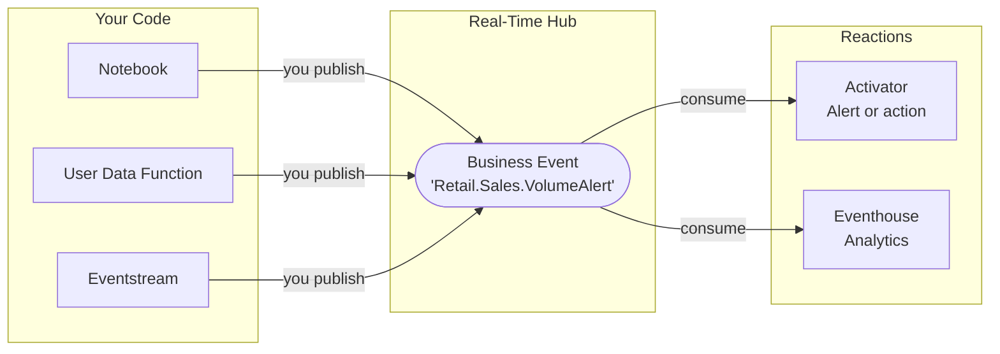
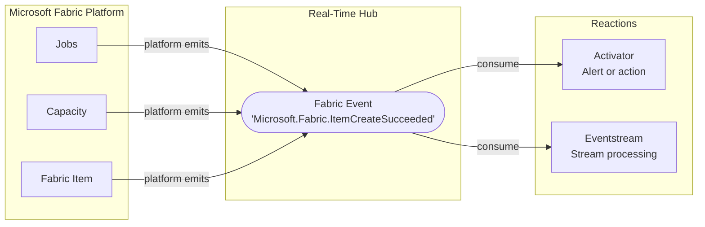
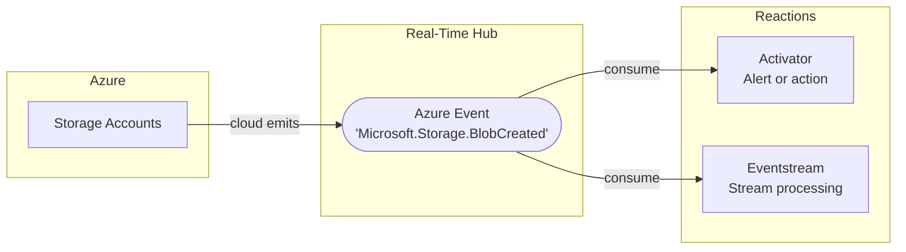

# Event-Driven Architectures in Microsoft Fabric

In a traditional data platform, workloads communicate by **polling or direct calls**: a service checks for changes on a schedule, or one workload calls another and waits for a response. This works, but it creates fragile dependencies and wastes compute on work that may find nothing to process.

**Event-driven architecture** inverts this model. Instead of asking "has something changed?", workloads signal "something happened" the moment it occurs. Any interested service reacts immediately, independently, and only when there is real work to do.

## Why it matters for Fabric

Microsoft Fabric is a unified platform where notebooks, pipelines, eventstreams, and analytics workloads run side by side. This creates natural opportunities for event-driven patterns: a notebook that finishes a transformation can signal downstream consumers, a threshold condition in a stream can trigger an alert, a pipeline completion can kick off the next stage automatically.

Without an event model, these interactions require scheduled triggers, hard-coded dependencies, or manual orchestration. With events, each workload stays focused on its own responsibility and reacts to what matters.

## The three event pillars

**[Business Events](../introduction/what-are-business-events.md)** are explicitly defined and published by your code. You decide what the event represents, what data it carries, and when it fires.

**[Fabric Events](../../fabric-events/index.md)** are emitted automatically by the platform. You do not write code to publish them. You only decide how to react when they occur.

**[Azure Events](../../azure-events/index.md)** connect Fabric workloads to the broader Azure ecosystem. Azure services publish events that Fabric can consume and react to in real time.

