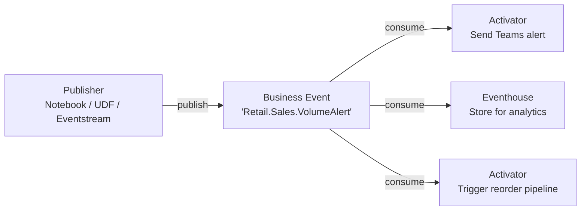
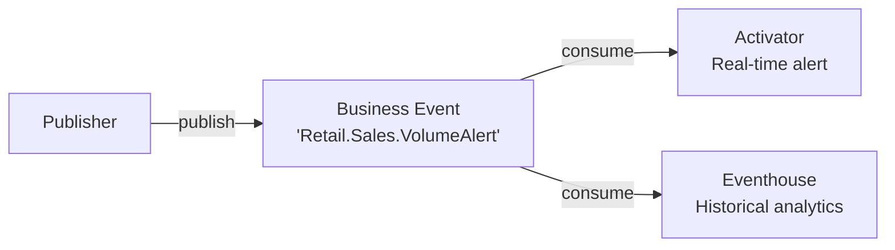
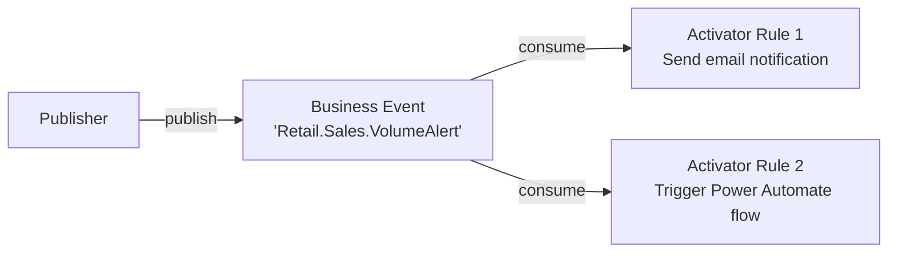
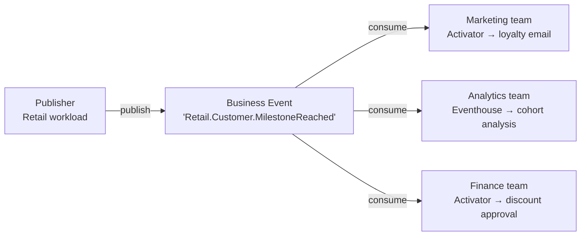

# Multi-Consumer Fanout

Fanout is a pattern where a single Business Event is consumed by multiple independent consumers simultaneously. Because Business Events is a pub/sub system, publishers do not need to know how many consumers exist — each consumer subscribes independently.

## One event, many consumers

Each consumer subscribes independently. Adding a new consumer does not require any change to the publisher.

## Common fanout patterns

### Alert + analytics

The most common combination — one consumer reacts in real time, another stores for historical analysis.

**When to use:** Any event where you need both immediate action and long-term visibility.

### Alert + automation

Two Activator consumers with different actions — one notifies a human, another triggers an automated workflow.

**When to use:** When a signal requires both human awareness and an automated response, and you want to manage them independently.

### Cross-domain fanout

A single business signal consumed by teams in different domains, each with their own logic.

**When to use:** When a business signal has value across multiple teams or domains, and each team should own their consumer independently.

## How to set up fanout

Each consumer is created independently — there is no fanout configuration on the publisher side.

| Consumer | How to add |
|----------|-----------|
| Activator | Real-Time Hub → Business events → Set alert → configure new rule |
| Eventhouse | Enabled at Business Event creation time via the "Analyze in Eventhouse" checkbox |

To add a second Activator consumer, simply create a new alert rule on the same Business Event. The two rules run independently and do not interfere with each other.

## Design considerations

**Keep consumers independent.** Each consumer should be able to fail, restart, or be updated without affecting others.

**Do not use fanout to sequence work.** If Consumer B must run after Consumer A completes, fanout is not the right pattern — use a dedicated orchestration mechanism instead.

**Monitor each consumer separately.** A delivery failure to one consumer does not affect delivery to others. Track consumer health individually.
