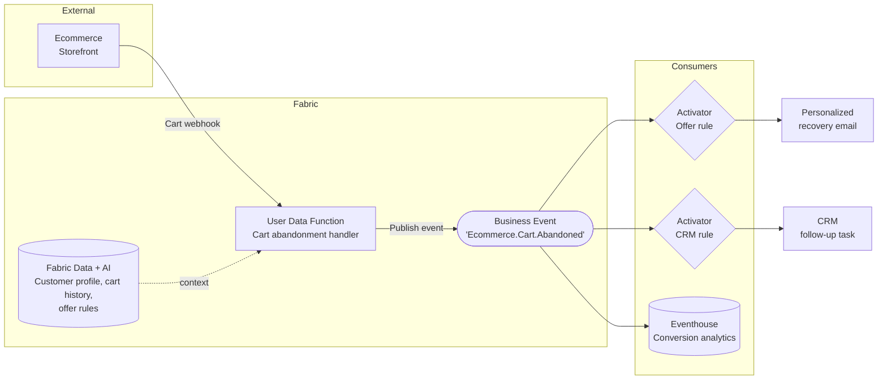
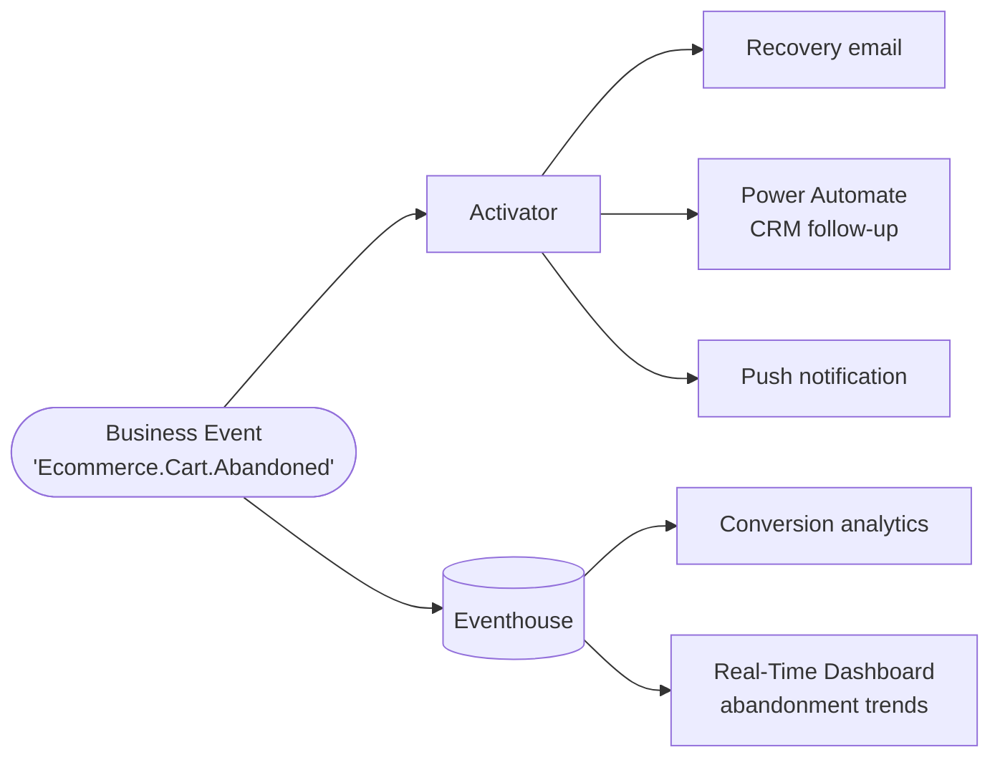

# Abandoned Cart Recovery

**Publisher:** User Data Function | **Consumer:** Activator, Eventhouse

## Business context

An ecommerce company loses significant revenue when customers add products to their cart but do not complete checkout. Most recovery strategies rely on scheduled batch jobs that fire hours after the abandonment occurs, long after the customer's intent has faded.

A User Data Function receives a real-time webhook from the storefront whenever a cart is abandoned. It retrieves the customer profile, evaluates eligibility for a recovery offer, and publishes a `Ecommerce.Cart.Abandoned` Business Event. Activator sends a personalized recovery email immediately. Eventhouse stores every event for conversion analytics.

**The problem without Business Events:**
The User Data Function would need to call the email service, the CRM follow-up API, and the analytics store directly. Each integration is a hard dependency. Changing the recovery channel — from email to push notification, for example — requires modifying the function code.

**The solution with Business Events:**
The User Data Function publishes one event. Activator delivers the personalized offer independently. The CRM follow-up is a separate Activator rule. A new recovery channel is a new subscription, not a code change.

## Architecture



## Step 1: Create the Business Event

Before publishing any event, define it in Real-Time Hub. Enable Eventhouse integration during this step.

1. Go to [Real-Time Hub → Business Events → Create](https://learn.microsoft.com/en-us/fabric/real-time-hub/business-events/create-business-events).
2. Create or select an Event Schema Set. Use `EcommerceCart` as the schema set name. You will need this name when connecting the Event Schema Set to the User Data Function through the connection manager.
3. Name the event `Ecommerce.Cart.Abandoned`.
4. In the schema editor, paste the following JSON:

    ```json
    {
      'type': 'record',
      'name': 'Ecommerce.Cart.Abandoned',
      'fields': [
        {
          'name': 'customer_id',
          'type': 'string',
          'doc': "Unique identifier of the customer"
        },
        {
          'name': 'customer_email',
          'type': 'string',
          'doc': "Customer email address for recovery communication"
        },
        {
          'name': 'cart_id',
          'type': 'string',
          'doc': "Unique identifier of the abandoned cart"
        },
        {
          'name': 'cart_value',
          'type': 'float',
          'doc': "Total value of items in the cart at time of abandonment"
        },
        {
          'name': 'item_count',
          'type': 'int',
          'doc': "Number of distinct items in the cart"
        },
        {
          'name': 'last_activity_at',
          'type': 'string',
          'doc': "ISO 8601 timestamp of the last customer cart interaction"
        }
      ]
    }
    ```

5. Confirm that **Analyze in Eventhouse** is enabled. Create a new Eventhouse or select an existing one in your workspace. This creates a dedicated KQL table named `Ecommerce.Cart.Abandoned` automatically.
6. Select **Create**.

## Step 2: Publisher - User Data Function

The User Data Function receives a webhook from the ecommerce storefront and publishes the Business Event.

### Create the User Data Function

1. In your Fabric workspace, select **+ New item** and create a **User Data Function** named `PublishCartAbandonedEvent`.
2. Inside the UDF item, select **New function**.

### Connect to the schema set

3. In the **Home** ribbon, select **Manage connections**.
4. Select **+ Add connection**, search for `EcommerceCart`, and select **Connect**.
5. Note the alias (`EcommerceCart` by default). Close the pane.

### Function code

```python
import fabric.functions as fn
import logging

udf = fn.UserDataFunctions()

@udf.connection(argName='businessEventsClient', alias='EcommerceCart')
@udf.function()
def publish_cart_abandoned_event(
    businessEventsClient: fn.FabricBusinessEventsClient,
    customer_id: str,
    customer_email: str,
    cart_id: str,
    cart_value: float,
    item_count: int,
    last_activity_at: str
) -> str:
    logging.info("publish_cart_abandoned_event invoked.")

    event_data = {
        'customer_id': customer_id,
        'customer_email': customer_email,
        'cart_id': cart_id,
        'cart_value': cart_value,
        'item_count': item_count,
        'last_activity_at': last_activity_at,
    }

    businessEventsClient.PublishEvent(
        type='Ecommerce.Cart.Abandoned',
        event_data=event_data,
        data_version='v1'
    )

    return "Event 'Ecommerce.Cart.Abandoned' published successfully"
```

For full details on publishing Business Events from User Data Functions, see the [User Data Function publisher documentation](https://learn.microsoft.com/en-us/fabric/real-time-hub/business-events/business-events-user-data-function).

## Step 3: Consumers

### Consumer 1 - Activator: Personalized recovery offer

1. In Real-Time Hub, locate `Ecommerce.Cart.Abandoned` under your schema set.
2. Select **Set alert** and name the rule `Cart Recovery - Offer`.
3. In the **Monitor** section, set **Source** to **Business events** and connect to `Ecommerce.Cart.Abandoned`.
4. Set **Condition** to `On each event`. Add an optional filter on `cart_value > 30` to focus recovery spend on higher-value carts.
5. In the **Action** section, configure the email or Power Automate flow that sends the personalized recovery offer. Add `customer_email`, `cart_id`, and `cart_value` as context fields.
6. Select **Save**.

### Consumer 2 - Activator: CRM follow-up task

1. In Real-Time Hub, locate `Ecommerce.Cart.Abandoned`.
2. Select **Set alert** and name the rule `Cart Recovery - CRM`.
3. Set **Condition** to `On each event`.
4. In the **Action** section, configure the Power Automate flow that creates a CRM follow-up task. Add `customer_id` and `cart_id` as context fields.
5. Select **Save**.

### Consumer 3 - Eventhouse: Conversion analytics

Eventhouse integration was enabled during event creation. Every published event is ingested into the `Ecommerce.Cart.Abandoned` KQL table automatically.

Open your Eventhouse KQL database and run the following queries to explore recovery patterns.

**Peak abandonment windows — last 7 days:**

```kusto
['Ecommerce.Cart.Abandoned']
| where ingestion_time() > ago(7d)
| extend HourOfDay = hourofday(ingestion_time())
| summarize Abandonments = count() by HourOfDay
| order by Abandonments desc
```

**High-value carts abandoned in the last 24 hours:**

```kusto
['Ecommerce.Cart.Abandoned']
| where ingestion_time() > ago(24h)
| where cart_value > 100
| project customer_id, cart_id, cart_value, item_count, last_activity_at
| order by cart_value desc
```

**Daily abandonment volume trend:**

```kusto
['Ecommerce.Cart.Abandoned']
| where ingestion_time() > ago(30d)
| summarize Abandonments = count() by bin(ingestion_time(), 1d)
| order by ingestion_time() asc
```

## Step 4: End-to-end test

Invoke `publish_cart_abandoned_event` with the following test values:

| Parameter | Value |
|---|---|
| `customer_id` | `cust-5521` |
| `customer_email` | `test@example.com` |
| `cart_id` | `cart-9987` |
| `cart_value` | `145.50` |
| `item_count` | `3` |
| `last_activity_at` | `2024-06-22T09:00:00Z` |

Then confirm the event arrived in Eventhouse:

```kusto
['Ecommerce.Cart.Abandoned']
| where cart_id == "cart-9987"
| order by ingestion_time() desc
| take 1
```

If the row is present and the Activator offer rule fires, your end-to-end setup is working.

## What happens next

With the event in place, recovery channels can be added, changed, or removed without touching the User Data Function.



| Extension | What it enables |
|---|---|
| **Recovery email** | Immediate personalized offer triggered by Activator |
| **CRM follow-up** | Sales task created via Power Automate for high-value carts |
| **Push notification** | Additional recovery channel — new Activator rule, no code change |
| **Conversion analytics** | Query which recovery timing and offer types drive the highest conversion |
| **Real-Time Dashboard** | Live view of abandonment volume and high-value cart pipeline |
