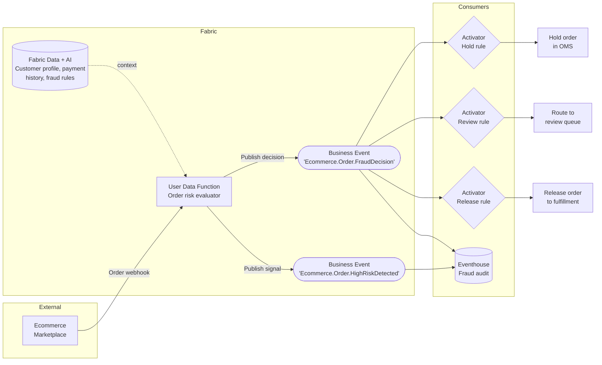
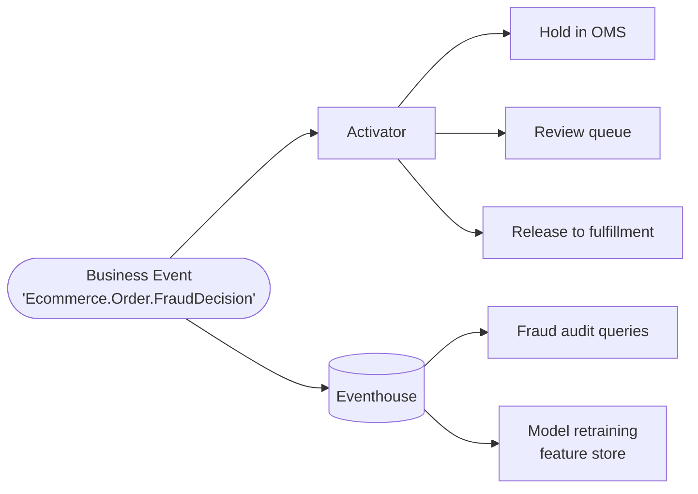

# Fraud Response Before Fulfillment

**Publisher:** User Data Function | **Consumer:** Activator, Eventhouse

## Business context

An ecommerce marketplace processes thousands of orders per hour. High-risk orders must be reviewed before fulfillment to prevent chargebacks, but manual inspection of every flagged order slows down legitimate customers.

A User Data Function receives an order webhook, evaluates the risk score against customer history, payment metadata, and fraud rules stored in Fabric, and publishes two Business Events: `Ecommerce.Order.HighRiskDetected` captures the signal, and `Ecommerce.Order.FraudDecision` carries the decision outcome (hold, manual review, or release). Three independent Activator rules act on the decision. Eventhouse stores the full audit trail for compliance and pattern analysis.

**The problem without Business Events:**
The User Data Function would need to call the order management system, the review queue, and the audit store directly. Any change to the hold logic or the review workflow requires modifying the function. A new downstream consumer — a compliance report, a fraud model retraining trigger — means another direct call.

**The solution with Business Events:**
The function publishes one decision event. Each action (hold, flag for review, release) is an independent Activator rule. New consumers subscribe without any change to the publisher.

## Architecture



## Step 1: Create the Business Events

This scenario uses two Business Events. Create both in Real-Time Hub before writing any function code.

### Event 1: HighRiskDetected

1. Go to [Real-Time Hub → Business Events → Create](https://learn.microsoft.com/en-us/fabric/real-time-hub/business-events/create-business-events).
2. Create or select an Event Schema Set. Use `EcommerceOrders` as the schema set name.
3. Name the event `Ecommerce.Order.HighRiskDetected`.
4. In the schema editor, paste the following JSON:

    ```json
    {
      'type': 'record',
      'name': 'Ecommerce.Order.HighRiskDetected',
      'fields': [
        {
          'name': 'order_id',
          'type': 'string',
          'doc': "Unique identifier of the order under review"
        },
        {
          'name': 'customer_id',
          'type': 'string',
          'doc': "Identifier of the customer who placed the order"
        },
        {
          'name': 'risk_score',
          'type': 'float',
          'doc': "Computed fraud risk score between 0.0 (low) and 1.0 (high)"
        },
        {
          'name': 'amount',
          'type': 'float',
          'doc': "Total order amount in the store local currency"
        },
        {
          'name': 'payment_method',
          'type': 'string',
          'doc': "Payment method: credit_card, debit_card, or digital_wallet"
        },
        {
          'name': 'detected_at',
          'type': 'string',
          'doc': "ISO 8601 timestamp of when the risk condition was detected"
        }
      ]
    }
    ```

5. Confirm that **Analyze in Eventhouse** is enabled. Select **Create**.

### Event 2: FraudDecision

1. In the same Event Schema Set (`EcommerceOrders`), select **+ New event**.
2. Name the event `Ecommerce.Order.FraudDecision`.
3. In the schema editor, paste the following JSON:

    ```json
    {
      'type': 'record',
      'name': 'Ecommerce.Order.FraudDecision',
      'fields': [
        {
          'name': 'order_id',
          'type': 'string',
          'doc': "Unique identifier of the order"
        },
        {
          'name': 'customer_id',
          'type': 'string',
          'doc': "Identifier of the customer who placed the order"
        },
        {
          'name': 'risk_score',
          'type': 'float',
          'doc': "Fraud risk score used to make this decision"
        },
        {
          'name': 'decision',
          'type': 'string',
          'doc': "Decision outcome: hold, manual_review, or release"
        },
        {
          'name': 'decided_at',
          'type': 'string',
          'doc': "ISO 8601 timestamp of when the decision was made"
        }
      ]
    }
    ```

4. Enable **Analyze in Eventhouse** and select **Create**.

## Step 2: Publisher - User Data Function

The User Data Function evaluates each order, makes a risk decision, and publishes both Business Events.

### Create the User Data Function

1. In your Fabric workspace, select **+ New item** and create a **User Data Function** named `EvaluateHighRiskOrder`.
2. Inside the UDF item, select **New function**.

### Connect to the schema set

3. In the **Home** ribbon, select **Manage connections**.
4. Select **+ Add connection**, search for `EcommerceOrders`, and select **Connect**.
5. Note the alias (`EcommerceOrders` by default). Close the pane.

### Function code

```python
import fabric.functions as fn
from datetime import datetime, timezone
import logging

udf = fn.UserDataFunctions()

@udf.connection(argName='businessEventsClient', alias='EcommerceOrders')
@udf.function()
def evaluate_high_risk_order(
    businessEventsClient: fn.FabricBusinessEventsClient,
    order_id: str,
    customer_id: str,
    risk_score: float,
    amount: float,
    payment_method: str
) -> str:
    logging.info("evaluate_high_risk_order invoked.")

    detected_at = datetime.now(timezone.utc).isoformat()

    # Publish the signal event — consumers can react to the raw detection
    businessEventsClient.PublishEvent(
        type='Ecommerce.Order.HighRiskDetected',
        event_data={
            'order_id': order_id,
            'customer_id': customer_id,
            'risk_score': risk_score,
            'amount': amount,
            'payment_method': payment_method,
            'detected_at': detected_at,
        },
        data_version='v1'
    )

    # Decision logic — thresholds can be loaded from Lakehouse or SQL DB
    if risk_score >= 0.85:
        decision = 'hold'
    elif risk_score >= 0.55:
        decision = 'manual_review'
    else:
        decision = 'release'

    # Publish the decision event — downstream consumers act on this independently
    businessEventsClient.PublishEvent(
        type='Ecommerce.Order.FraudDecision',
        event_data={
            'order_id': order_id,
            'customer_id': customer_id,
            'risk_score': risk_score,
            'decision': decision,
            'decided_at': datetime.now(timezone.utc).isoformat(),
        },
        data_version='v1'
    )

    return f"Order {order_id}: decision = {decision}"
```

For full details on publishing Business Events from User Data Functions, see the [User Data Function publisher documentation](https://learn.microsoft.com/en-us/fabric/real-time-hub/business-events/business-events-user-data-function).

## Step 3: Consumers

### Consumer 1 - Activator: Hold order

1. In Real-Time Hub, locate `Ecommerce.Order.FraudDecision`.
2. Select **Set alert** and name the rule `Fraud - Hold Order`.
3. Set **Condition** to `On each event`. Add filter: `decision == hold`.
4. In **Action**, configure the Power Automate flow or webhook that places the order on hold in your order management system. Add `order_id` and `risk_score` as context fields.
5. Select **Save**.

### Consumer 2 - Activator: Route to manual review

1. Locate `Ecommerce.Order.FraudDecision` and select **Set alert**.
2. Name the rule `Fraud - Manual Review`. Add filter: `decision == manual_review`.
3. In **Action**, configure the workflow that routes the order to the fraud review queue. Add `order_id`, `customer_id`, and `risk_score` as context fields.
4. Select **Save**.

### Consumer 3 - Activator: Release order

1. Locate `Ecommerce.Order.FraudDecision` and select **Set alert**.
2. Name the rule `Fraud - Release`. Add filter: `decision == release`.
3. In **Action**, configure the webhook that resumes order fulfillment. Add `order_id` as context.
4. Select **Save**.

### Consumer 4 - Eventhouse: Fraud audit trail

Both events are ingested automatically. Use the following queries to monitor decision patterns.

**Decision distribution by payment method — last 30 days:**

```kusto
['Ecommerce.Order.FraudDecision']
| where ingestion_time() > ago(30d)
| summarize Orders = count() by decision, payment_method
| order by Orders desc
```

**Risk score distribution over time:**

```kusto
['Ecommerce.Order.HighRiskDetected']
| where ingestion_time() > ago(7d)
| summarize AvgRisk = avg(risk_score), OrderCount = count()
  by bin(ingestion_time(), 1h)
| order by ingestion_time() asc
```

**Hold rate by payment method:**

```kusto
['Ecommerce.Order.FraudDecision']
| where ingestion_time() > ago(30d)
| summarize
    Total = count(),
    Held = countif(decision == 'hold')
  by payment_method
| extend HoldRate = round(todouble(Held) / Total * 100, 1)
| order by HoldRate desc
```

## Step 4: End-to-end test

Invoke `evaluate_high_risk_order` with the following test values:

| Parameter | Value |
|---|---|
| `order_id` | `ord-44219` |
| `customer_id` | `cust-882` |
| `risk_score` | `0.91` |
| `amount` | `340.00` |
| `payment_method` | `credit_card` |

A `risk_score` of `0.91` exceeds the `0.85` threshold, so the expected decision is `hold`. Confirm both events arrived:

```kusto
['Ecommerce.Order.FraudDecision']
| where order_id == "ord-44219"
| project order_id, decision, risk_score, decided_at
| take 1
```

If the row shows `decision = hold` and the Hold Order Activator rule fires, your setup is working.

## What happens next

The two-event pattern — signal first, decision second — lets different consumers subscribe at different stages of the pipeline without coupling them together.



| Extension | What it enables |
|---|---|
| **Hold / Review / Release** | Independent Activator rules per decision outcome |
| **Fraud audit queries** | Full decision history with risk scores and payment context |
| **Model retraining** | Historical decision events as labeled training data for the fraud model |
| **Compliance report** | Export the audit trail for regulatory requirements |
