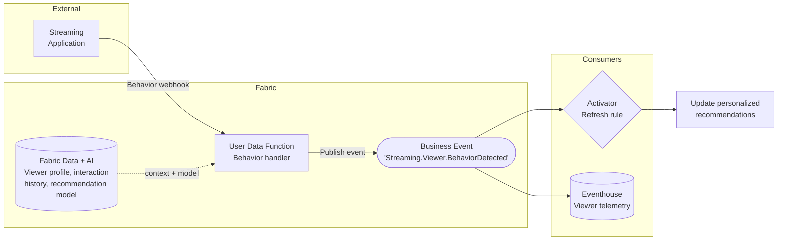
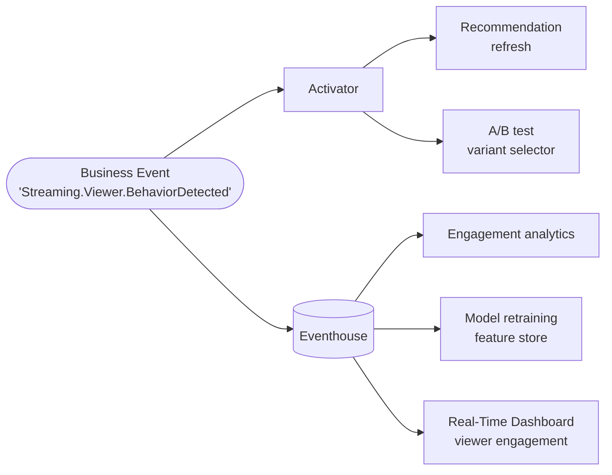

# Real-Time Viewer Recommendations

**Publisher:** User Data Function | **Consumer:** Activator, Eventhouse

## Business context

A streaming platform serves personalized content recommendations. Traditional recommendation systems refresh on a schedule — every hour or every session — meaning recommendations reflect what the viewer watched yesterday, not what they are engaging with right now.

A User Data Function receives a webhook each time a meaningful viewer interaction occurs: a click, a search, a skip, or a sustained watch. It retrieves the viewer's current profile and interaction history from Fabric, calls the recommendation model, and publishes a `Streaming.Viewer.BehaviorDetected` Business Event. Activator triggers an immediate recommendation refresh. Eventhouse stores the interaction stream for CTR analysis and model retraining.

**The problem without Business Events:**
The User Data Function would need to call the recommendation serving layer, the personalization API, and the telemetry store directly. Adding a new downstream consumer — an A/B testing framework, a churn model — requires modifying the function.

**The solution with Business Events:**
The function publishes one behavior event. Activator refreshes recommendations immediately. Analytics teams subscribe to Eventhouse independently. Any new consumer adds a subscription, not a code change.

## Architecture



## Step 1: Create the Business Event

1. Go to [Real-Time Hub → Business Events → Create](https://learn.microsoft.com/en-us/fabric/real-time-hub/business-events/create-business-events).
2. Create or select an Event Schema Set. Use `StreamingViewer` as the schema set name. You will need this name when connecting the Event Schema Set to the User Data Function through the connection manager.
3. Name the event `Streaming.Viewer.BehaviorDetected`.
4. In the schema editor, paste the following JSON:

    ```json
    {
      'type': 'record',
      'name': 'Streaming.Viewer.BehaviorDetected',
      'fields': [
        {
          'name': 'viewer_id',
          'type': 'string',
          'doc': "Unique identifier of the viewer"
        },
        {
          'name': 'session_id',
          'type': 'string',
          'doc': "Identifier of the current streaming session"
        },
        {
          'name': 'content_id',
          'type': 'string',
          'doc': "Identifier of the content being interacted with"
        },
        {
          'name': 'action',
          'type': 'string',
          'doc': "Type of interaction: click, search, watch, skip, or like"
        },
        {
          'name': 'occurred_at',
          'type': 'string',
          'doc': "ISO 8601 timestamp of the viewer interaction"
        }
      ]
    }
    ```

5. Confirm that **Analyze in Eventhouse** is enabled. Create a new Eventhouse or select an existing one. This creates a dedicated KQL table named `Streaming.Viewer.BehaviorDetected` automatically.
6. Select **Create**.

## Step 2: Publisher - User Data Function

The User Data Function receives a behavior webhook from the streaming application and publishes the Business Event.

### Create the User Data Function

1. In your Fabric workspace, select **+ New item** and create a **User Data Function** named `PublishViewerBehaviorEvent`.
2. Inside the UDF item, select **New function**.

### Connect to the schema set

3. In the **Home** ribbon, select **Manage connections**.
4. Select **+ Add connection**, search for `StreamingViewer`, and select **Connect**.
5. Note the alias (`StreamingViewer` by default). Close the pane.

### Function code

```python
import fabric.functions as fn
import logging

udf = fn.UserDataFunctions()

@udf.connection(argName='businessEventsClient', alias='StreamingViewer')
@udf.function()
def publish_viewer_behavior_event(
    businessEventsClient: fn.FabricBusinessEventsClient,
    viewer_id: str,
    session_id: str,
    content_id: str,
    action: str,
    occurred_at: str
) -> str:
    logging.info("publish_viewer_behavior_event invoked.")

    event_data = {
        'viewer_id': viewer_id,
        'session_id': session_id,
        'content_id': content_id,
        'action': action,
        'occurred_at': occurred_at,
    }

    businessEventsClient.PublishEvent(
        type='Streaming.Viewer.BehaviorDetected',
        event_data=event_data,
        data_version='v1'
    )

    return "Event 'Streaming.Viewer.BehaviorDetected' published successfully"
```

For full details on publishing Business Events from User Data Functions, see the [User Data Function publisher documentation](https://learn.microsoft.com/en-us/fabric/real-time-hub/business-events/business-events-user-data-function).

## Step 3: Consumers

### Consumer 1 - Activator: Recommendation refresh

1. In Real-Time Hub, locate `Streaming.Viewer.BehaviorDetected`.
2. Select **Set alert** and name the rule `Viewer Behavior - Refresh Recommendations`.
3. Set **Condition** to `On each event`. Add an optional filter on `action` to refresh only on high-signal interactions (for example, `action == watch` or `action == like`).
4. In **Action**, configure the User Data Function or Power Automate flow that calls the recommendation serving layer to refresh the viewer's queue. Add `viewer_id`, `session_id`, and `content_id` as context fields.
5. Select **Save**.

### Consumer 2 - Eventhouse: Viewer telemetry

Eventhouse integration was enabled during event creation. Every published event is ingested into the `Streaming.Viewer.BehaviorDetected` KQL table automatically.

**Recommendation refresh rate — events per hour, last 24 hours:**

```kusto
['Streaming.Viewer.BehaviorDetected']
| where ingestion_time() > ago(24h)
| summarize EventCount = count() by bin(ingestion_time(), 1h)
| order by ingestion_time() asc
```

**Most engaged content by interaction type:**

```kusto
['Streaming.Viewer.BehaviorDetected']
| where ingestion_time() > ago(7d)
| where action in ('watch', 'like')
| summarize Engagements = count() by content_id, action
| order by Engagements desc
| take 20
```

**Viewer session activity — depth of interaction:**

```kusto
['Streaming.Viewer.BehaviorDetected']
| where ingestion_time() > ago(1d)
| summarize
    Actions = count(),
    UniqueContent = dcount(content_id)
  by viewer_id, session_id
| order by Actions desc
```

## Step 4: End-to-end test

Invoke `publish_viewer_behavior_event` with the following test values:

| Parameter | Value |
|---|---|
| `viewer_id` | `viewer-7712` |
| `session_id` | `sess-3301` |
| `content_id` | `content-882` |
| `action` | `watch` |
| `occurred_at` | `2024-06-22T09:00:00Z` |

Then confirm the event arrived in Eventhouse:

```kusto
['Streaming.Viewer.BehaviorDetected']
| where viewer_id == "viewer-7712"
| order by ingestion_time() desc
| take 1
```

If the row is present and the Activator refresh rule fires, your end-to-end setup is working.

## What happens next

With behavior events flowing, analytics and personalization teams can build independently on the same signal.



| Extension | What it enables |
|---|---|
| **Recommendation refresh** | Immediate personalization update triggered by Activator |
| **A/B test variant selector** | Route viewers to different recommendation algorithms based on behavior |
| **Engagement analytics** | Query which content and action types drive the most repeat engagement |
| **Model retraining** | Use the interaction stream as labeled training data for the recommendation model |
| **Real-Time Dashboard** | Live viewer engagement metrics by hour and content |
