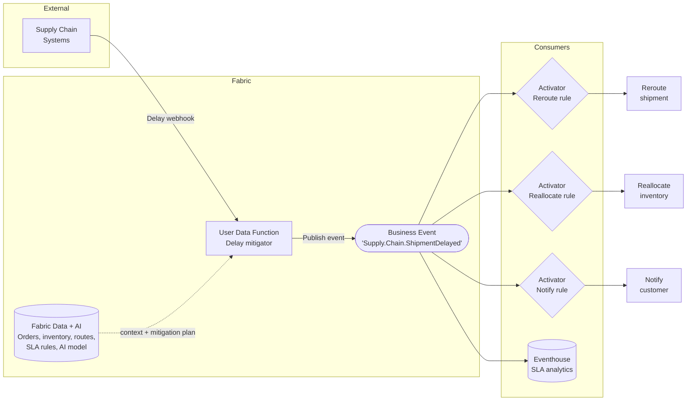
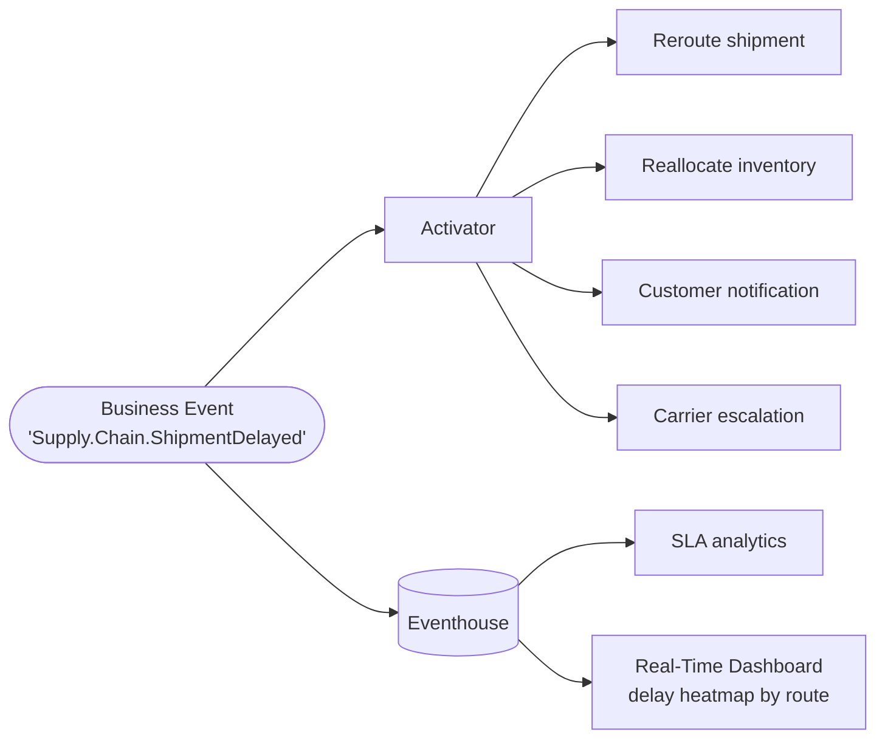

# Scenario 9: Shipment Delay Auto-Mitigation

**Publisher:** User Data Function | **Consumer:** Activator, Eventhouse

## Business context

A logistics company manages thousands of shipments per day across multiple carriers and routes. When a delay is detected, the standard response requires a human to identify the affected order, assess available inventory and alternate routes, notify the customer, and log the incident — a process that can take hours and routinely results in SLA breaches.

A User Data Function receives a delay signal from the supply chain system, retrieves order, inventory, route, and SLA context from Fabric, calls an AI model to generate a mitigation plan, and publishes a `Supply.Chain.ShipmentDelayed` Business Event. Three independent Activator rules act on the event: one reroutes the shipment, one reallocates inventory, and one notifies the customer. Eventhouse stores the full delay record for SLA reporting and route performance analysis.

**The problem without Business Events:**
The User Data Function would need to call the routing system, the inventory system, the customer notification API, and the audit store directly. Adding a new mitigation action — escalating to a carrier account manager, for example — requires modifying the function code and redeploying.

**The solution with Business Events:**
The function publishes one delay event carrying the full mitigation context. Each action is an independent Activator rule. A new mitigation step is a new subscription, not a code change.

## Architecture



## Step 1: Create the Business Event

1. Go to [Real-Time Hub → Business Events → Create](https://learn.microsoft.com/en-us/fabric/real-time-hub/business-events/create-business-events).
2. Create or select an Event Schema Set. Use `SupplyChain` as the schema set name. You will need this name when connecting the Event Schema Set to the User Data Function through the connection manager.
3. Name the event `Supply.Chain.ShipmentDelayed`.
4. In the schema editor, paste the following JSON:

    ```json
    {
      'type': 'record',
      'name': 'Supply.Chain.ShipmentDelayed',
      'fields': [
        {
          'name': 'shipment_id',
          'type': 'string',
          'doc': "Unique identifier of the delayed shipment"
        },
        {
          'name': 'order_id',
          'type': 'string',
          'doc': "Identifier of the order associated with this shipment"
        },
        {
          'name': 'route_id',
          'type': 'string',
          'doc': "Identifier of the current shipping route"
        },
        {
          'name': 'carrier_id',
          'type': 'string',
          'doc': "Identifier of the carrier responsible for the shipment"
        },
        {
          'name': 'delay_minutes',
          'type': 'int',
          'doc': "Estimated delay in minutes relative to the original SLA"
        },
        {
          'name': 'sla_breach',
          'type': 'boolean',
          'doc': "True if the delay results in an SLA breach"
        },
        {
          'name': 'detected_at',
          'type': 'string',
          'doc': "ISO 8601 timestamp of when the delay was detected"
        }
      ]
    }
    ```

5. Confirm that **Analyze in Eventhouse** is enabled. Create a new Eventhouse or select an existing one. This creates a dedicated KQL table named `Supply.Chain.ShipmentDelayed` automatically.
6. Select **Create**.

## Step 2: Publisher - User Data Function

The User Data Function receives a delay signal, enriches it with Fabric data and AI context, and publishes the Business Event.

### Create the User Data Function

1. In your Fabric workspace, select **+ New item** and create a **User Data Function** named `PublishShipmentDelayedEvent`.
2. Inside the UDF item, select **New function**.

### Connect to the schema set

3. In the **Home** ribbon, select **Manage connections**.
4. Select **+ Add connection**, search for `SupplyChain`, and select **Connect**.
5. Note the alias (`SupplyChain` by default). Close the pane.

### Function code

```python
import fabric.functions as fn
from datetime import datetime, timezone
import logging

udf = fn.UserDataFunctions()

@udf.connection(argName='businessEventsClient', alias='SupplyChain')
@udf.function()
def publish_shipment_delayed_event(
    businessEventsClient: fn.FabricBusinessEventsClient,
    shipment_id: str,
    order_id: str,
    route_id: str,
    carrier_id: str,
    delay_minutes: int,
    sla_breach: bool
) -> str:
    logging.info("publish_shipment_delayed_event invoked.")

    event_data = {
        'shipment_id': shipment_id,
        'order_id': order_id,
        'route_id': route_id,
        'carrier_id': carrier_id,
        'delay_minutes': delay_minutes,
        'sla_breach': sla_breach,
        'detected_at': datetime.now(timezone.utc).isoformat(),
    }

    businessEventsClient.PublishEvent(
        type='Supply.Chain.ShipmentDelayed',
        event_data=event_data,
        data_version='v1'
    )

    return f"Event 'Supply.Chain.ShipmentDelayed' published for shipment {shipment_id}"
```

For full details on publishing Business Events from User Data Functions, see the [User Data Function publisher documentation](https://learn.microsoft.com/en-us/fabric/real-time-hub/business-events/business-events-user-data-function).

## Step 3: Consumers

### Consumer 1 - Activator: Reroute shipment

1. In Real-Time Hub, locate `Supply.Chain.ShipmentDelayed`.
2. Select **Set alert** and name the rule `Delay - Reroute Shipment`.
3. Set **Condition** to `On each event`. Add filter: `sla_breach == true`.
4. In **Action**, configure the Power Automate flow or webhook that calls the routing system to switch the shipment to an alternate route. Add `shipment_id`, `route_id`, and `delay_minutes` as context fields.
5. Select **Save**.

### Consumer 2 - Activator: Reallocate inventory

1. Locate `Supply.Chain.ShipmentDelayed` and select **Set alert**.
2. Name the rule `Delay - Reallocate Inventory`. Add filter: `delay_minutes > 240`.
3. In **Action**, configure the flow that triggers an inventory reallocation from the nearest fulfillment center. Add `order_id` and `shipment_id` as context fields.
4. Select **Save**.

### Consumer 3 - Activator: Notify customer

1. Locate `Supply.Chain.ShipmentDelayed` and select **Set alert**.
2. Name the rule `Delay - Notify Customer`.
3. Set **Condition** to `On each event` (notify for all delays, not only SLA breaches).
4. In **Action**, configure the email or SMS notification flow. Add `order_id`, `delay_minutes`, and `sla_breach` as context fields.
5. Select **Save**.

### Consumer 4 - Eventhouse: SLA analytics

Every delay event is ingested automatically. Use the following queries to monitor route performance and SLA impact.

**Delays by route — last 7 days:**

```kusto
['Supply.Chain.ShipmentDelayed']
| where ingestion_time() > ago(7d)
| summarize DelayCount = count(), AvgDelay = avg(delay_minutes) by route_id
| order by DelayCount desc
```

**SLA breach rate by carrier:**

```kusto
['Supply.Chain.ShipmentDelayed']
| where ingestion_time() > ago(30d)
| summarize
    Total = count(),
    Breaches = countif(sla_breach == true)
  by carrier_id
| extend BreachRate = round(todouble(Breaches) / Total * 100, 1)
| order by BreachRate desc
```

**Delay trend over the last 30 days:**

```kusto
['Supply.Chain.ShipmentDelayed']
| where ingestion_time() > ago(30d)
| summarize
    Delays = count(),
    AvgDelayMins = avg(delay_minutes),
    SLABreaches = countif(sla_breach == true)
  by bin(ingestion_time(), 1d)
| order by ingestion_time() asc
```

## Step 4: End-to-end test

Invoke `publish_shipment_delayed_event` with the following test values:

| Parameter | Value |
|---|---|
| `shipment_id` | `shp-77412` |
| `order_id` | `ord-55200` |
| `route_id` | `route-mx-la` |
| `carrier_id` | `carrier-004` |
| `delay_minutes` | `300` |
| `sla_breach` | `true` |

Then confirm the event arrived in Eventhouse:

```kusto
['Supply.Chain.ShipmentDelayed']
| where shipment_id == "shp-77412"
| project shipment_id, route_id, delay_minutes, sla_breach, detected_at
| take 1
```

If the row is present and all three Activator rules fire, your end-to-end setup is working.

## What happens next

With delay events flowing, logistics, customer experience, and finance teams can build on the same signal independently.



| Extension | What it enables |
|---|---|
| **Reroute shipment** | Activator switches to alternate route for SLA breaches |
| **Reallocate inventory** | Activator triggers fulfillment center reallocation for long delays |
| **Customer notification** | Proactive delay communication via email or SMS |
| **Carrier escalation** | New Activator rule that notifies the carrier account manager for repeat breaches |
| **SLA analytics** | Route and carrier performance history for contract reviews |
| **Delay heatmap** | Real-Time Dashboard showing delay density by route and time window |
